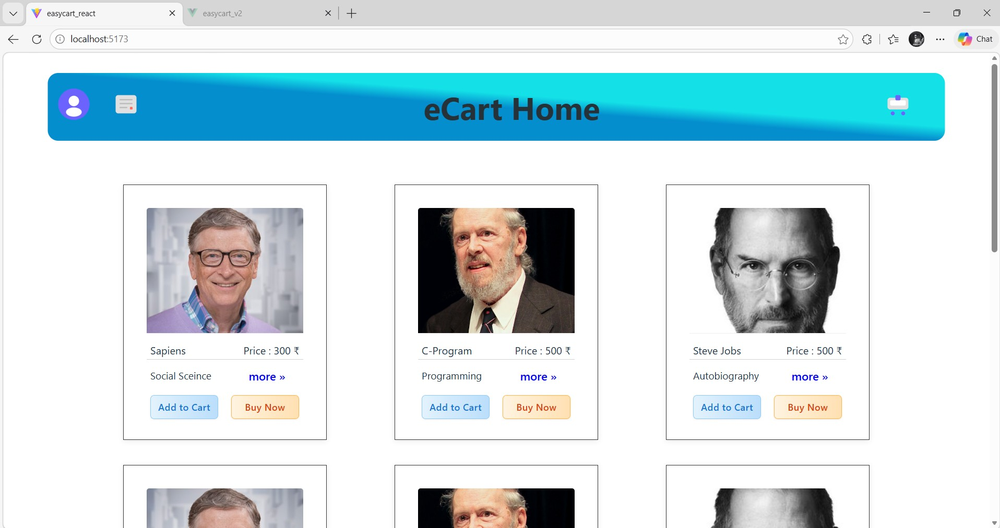
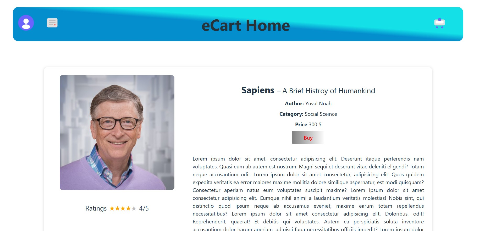
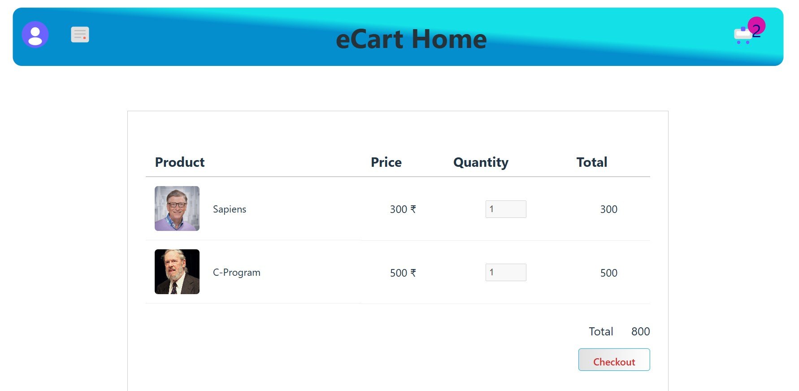
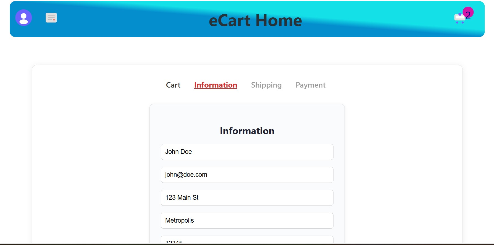
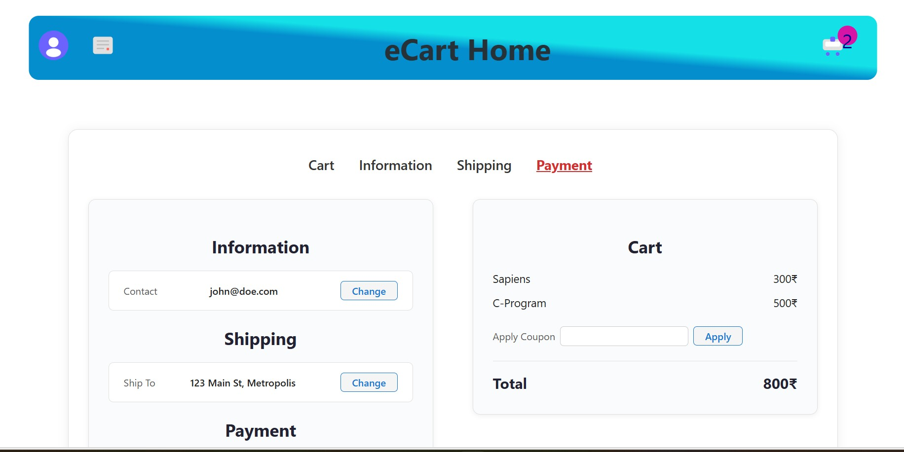
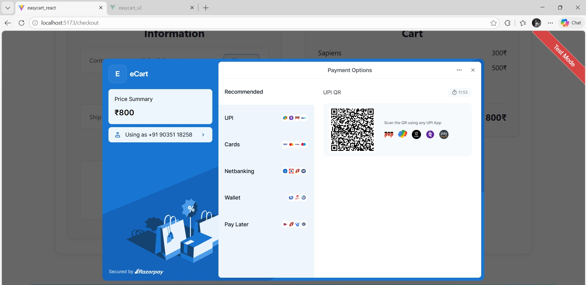

# easyCart React

A modern e-commerce demo app built with React, TypeScript, Redux Toolkit, and Vite.

## Features

- **Product Catalog**: Browse a list of books with images, categories, authors, and prices.
- **Product Details**: View detailed information, ratings, and reviews for each book.
- **Add to Cart & Buy Now**: Add items to your cart or proceed directly to checkout.
- **Dynamic Cart**: Cart page displays only items added by the user, with real-time updates.
- **Multi-step Checkout**: Information, Shipping, and Payment steps with a summary and coupon support.
- **Razorpay Integration**: Secure online payments using Razorpay (test mode).
- **Responsive Design**: Clean, modern UI that works on desktop and mobile.
- **Redux State Management**: Cart state is managed globally for a seamless experience.
- **Header & Footer**: Consistent, full-width header and footer across all pages.
- **Empty Cart Handling**: Cart page shows a friendly message if no items are added.

## Screenshots

+### Home Page


### Product Details


### Cart Page


### Checkout


### Payment


### Online Payment (Razorpay)


## Getting Started

1. **Install dependencies**
   ```bash
   npm install
   ```

2. **Run the app**
   ```bash
   npm run dev
   ```

3. **Open in browser**
   ```
   http://localhost:5173
   ```

## Project Structure

- `src/components/` – All React components (Home, Cart, Details, Checkout, etc.)
- `src/store/` – Redux Toolkit store and cart slice
- `src/assets/data/data.json` – Product data
- `src/assets/images/` – Product images

## Tech Stack

- React + TypeScript
- Redux Toolkit
- Vite
- Razorpay (test mode)
- CSS Modules

## License

This project is for demo and educational purposes.
